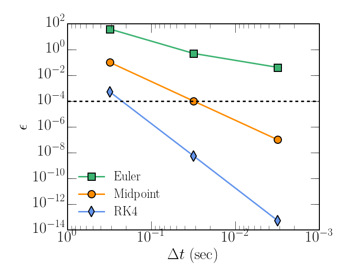

# In-Class Assignment #4
All figures and computations for the material presented in this assignment is available in its entirety in this [`jupyter` notebook](./ica4.ipynb). Only the key points will be shown here.  <br> <br>

We implemented used the Euler from PCA4 and implemented, the midpoint, and 4-th order Runge-Kutta method of solving ODE's.

## Midpoint Method

The algorithm in its entirety is given below:

```python
def ode_mp(x0,t0,v0,tf,dt,m,k):
    # initialize counter 
    i = 0
    
    # make arrays for computation 
    time = np.arange(t0,tf,dt)
    pos = np.zeros(len(time))
    vel = np.zeros(len(time))
    
    # intial conditions
    pos[0] = x0
    vel[0] = v0
    while i < len(time)-1: 
        pos_half = pos[i] + ((dt/2.)*(vel[i]))
        vel_half = vel[i] + ((dt/2.)*(force_1d(k,pos[i])/m))
        accel_half = force_1d(k,pos_half)/m 
        pos[i+1] = pos[i] + vel_half*dt
        vel[i+1] = vel[i] + accel_half*dt
        
        # update the counter
        i = i + 1
    return time,pos,vel
```

## 4-th order Runge-Kutta Method (RK4)

The algorithm in its entirety is given below:

```python
def ode_rk4(x0,t0,v0,tf,dt,m,k):
    # initialize counter 
    i = 0
    
    # make arrays for computation 
    time = np.arange(t0,tf,dt)
    pos = np.zeros(len(time))
    vel = np.zeros(len(time))
    
    # intial conditions
    pos[0] = x0
    vel[0] = v0
    while i < len(time)-1: 
        x1 = pos[i]
        v1 = vel[i]
        a1 = force_1d(k,x1)/m
        
        x2 = pos[i] + ((dt/2.)*(v1)) 
        v2 = vel[i] + ((dt/2.)*(a1)) 
        a2 = force_1d(k,x2)/m
        
        x3 = pos[i] + ((dt/2.)*(v2))
        v3 = vel[i] + ((dt/2.)*a2)
        a3 = force_1d(k,x3)/m
        
        x4 = pos[i] + (dt*v3)
        v4 = vel[i] + (dt*a3)
        a4 = force_1d(k,x4)/m
        
        pos[i+1] = pos[i] + (dt/6.)*((v1+2.*v2+2.*v3+v4))
        vel[i+1] = vel[i] + (dt/6.)*((a1+2.*a2+2.*a3+a4))
        
        # update the counter
        i = i + 1
    return time,pos,vel
```

1. For given timestep sizes, $\Delta t = \pi 10^{-1}$, $\Delta t = \pi 10^{-2}$, and $\Delta t = \pi 10^{-3}$, what is the difference in the relative change in energy between the Euler methods and these two methods?

In Figure [(1)](./ica4_ex1_1.png), I show the result of the integration using the Euler, midpoint, and RK4 methods for time steps of $\Delta t = \pi 10^{-1}$, $\Delta t = \pi 10^{-2}$, and $\Delta t = \pi 10^{-3}$. 


**Figure 1:** Energy conservation for both methods as a function of the timestep using the Euler, midpoint, and RK4 methods for time steps of $\Delta t = \pi 10^{-1}$, $\Delta t = \pi 10^{-2}$, and $\Delta t = \pi 10^{-3}$. The horizontal is an energy accuracy of $0.01\%$.

2. Assume you wish to maintain energy to a given level of accuracy - say 0.01% between t = 0 and t = 4π. 
	* How many time steps of each of your methods do you need to reach that level of accuracy? 
	* How many total floating-point operations is that for each method for the entire integration?

For an relative error in energy conservation of $\epsilon \le 0.01 \%$, you would need a timestep of:

* $\Delta t \sim 0.22$ for RK4
* $\Delta t \sim 0.03$ for Midpoint

For the Euler method, it appears that energy cannot be conserved to that precision for any chosen timestep as the trend levels off.

The result of the speed of the integrators is given below:

```python
EULER:

         4009 function calls in 0.005 seconds

   Ordered by: standard name

   ncalls  tottime  percall  cumtime  percall filename:lineno(function)
        1    0.000    0.000    0.005    0.005 <string>:1(<module>)
        1    0.005    0.005    0.005    0.005 ode.py:3(ode_euler)
        1    0.000    0.000    0.005    0.005 {built-in method builtins.exec}
     4002    0.000    0.000    0.000    0.000 {built-in method builtins.len}
        1    0.000    0.000    0.000    0.000 {built-in method numpy.core.multiarray.arange}
        2    0.000    0.000    0.000    0.000 {built-in method numpy.core.multiarray.zeros}
        1    0.000    0.000    0.000    0.000 {method 'disable' of '_lsprof.Profiler' objects}


MIDPOINT:

         12007 function calls in 0.010 seconds

   Ordered by: standard name

   ncalls  tottime  percall  cumtime  percall filename:lineno(function)
     7998    0.001    0.000    0.001    0.000 <ipython-input-3-11501802bb84>:11(force_1d)
        1    0.008    0.008    0.010    0.010 <ipython-input-3-11501802bb84>:25(ode_mp)
        1    0.000    0.000    0.010    0.010 <string>:1(<module>)
        1    0.000    0.000    0.010    0.010 {built-in method builtins.exec}
     4002    0.000    0.000    0.000    0.000 {built-in method builtins.len}
        1    0.000    0.000    0.000    0.000 {built-in method numpy.core.multiarray.arange}
        2    0.000    0.000    0.000    0.000 {built-in method numpy.core.multiarray.zeros}
        1    0.000    0.000    0.000    0.000 {method 'disable' of '_lsprof.Profiler' objects}


RK4:

         20005 function calls in 0.019 seconds

   Ordered by: standard name

   ncalls  tottime  percall  cumtime  percall filename:lineno(function)
    15996    0.002    0.000    0.002    0.000 <ipython-input-3-11501802bb84>:11(force_1d)
        1    0.016    0.016    0.019    0.019 <ipython-input-3-11501802bb84>:49(ode_rk4)
        1    0.000    0.000    0.019    0.019 <string>:1(<module>)
        1    0.000    0.000    0.019    0.019 {built-in method builtins.exec}
     4002    0.000    0.000    0.000    0.000 {built-in method builtins.len}
        1    0.000    0.000    0.000    0.000 {built-in method numpy.core.multiarray.arange}
        2    0.000    0.000    0.000    0.000 {built-in method numpy.core.multiarray.zeros}
        1    0.000    0.000    0.000    0.000 {method 'disable' of '_lsprof.Profiler' objects}

```